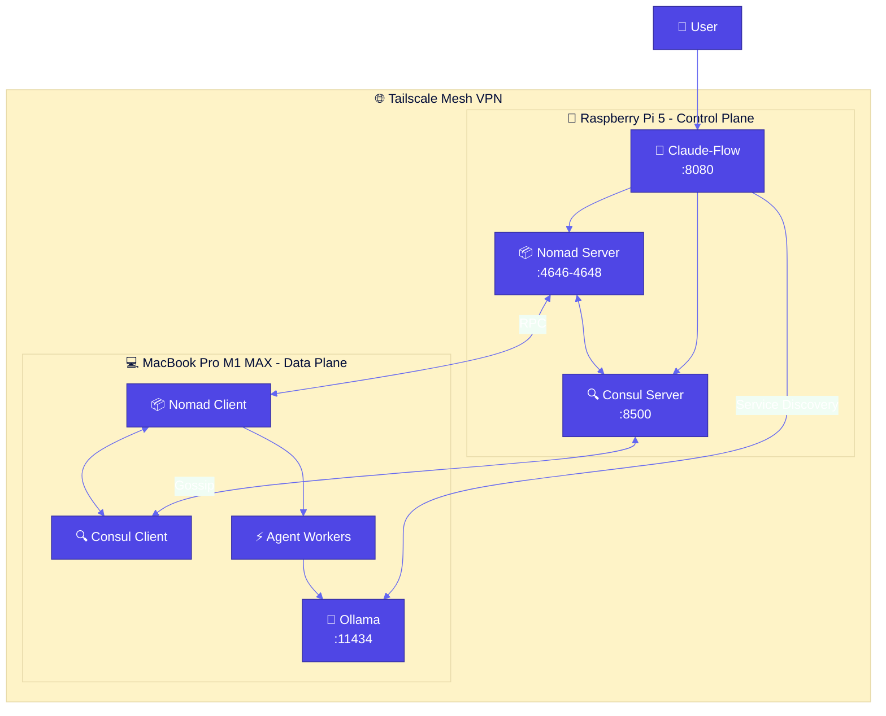
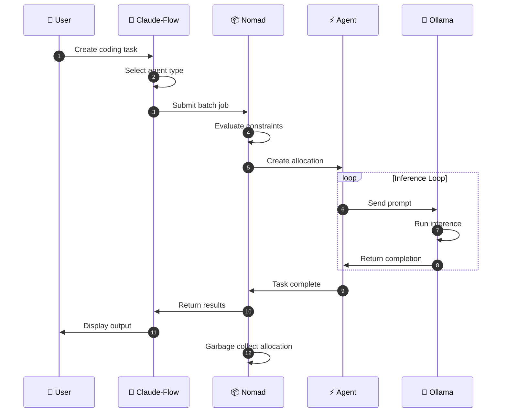
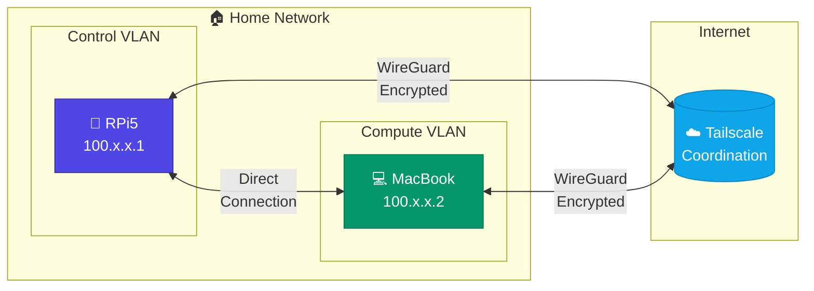
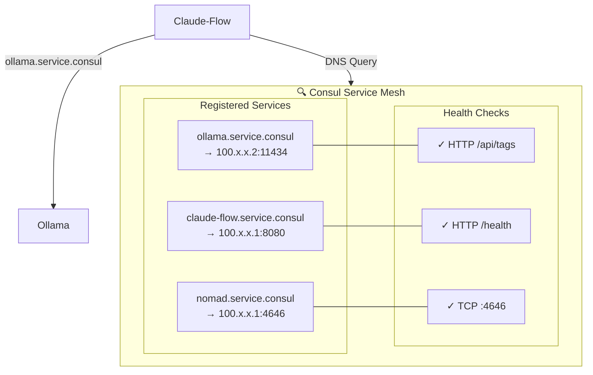
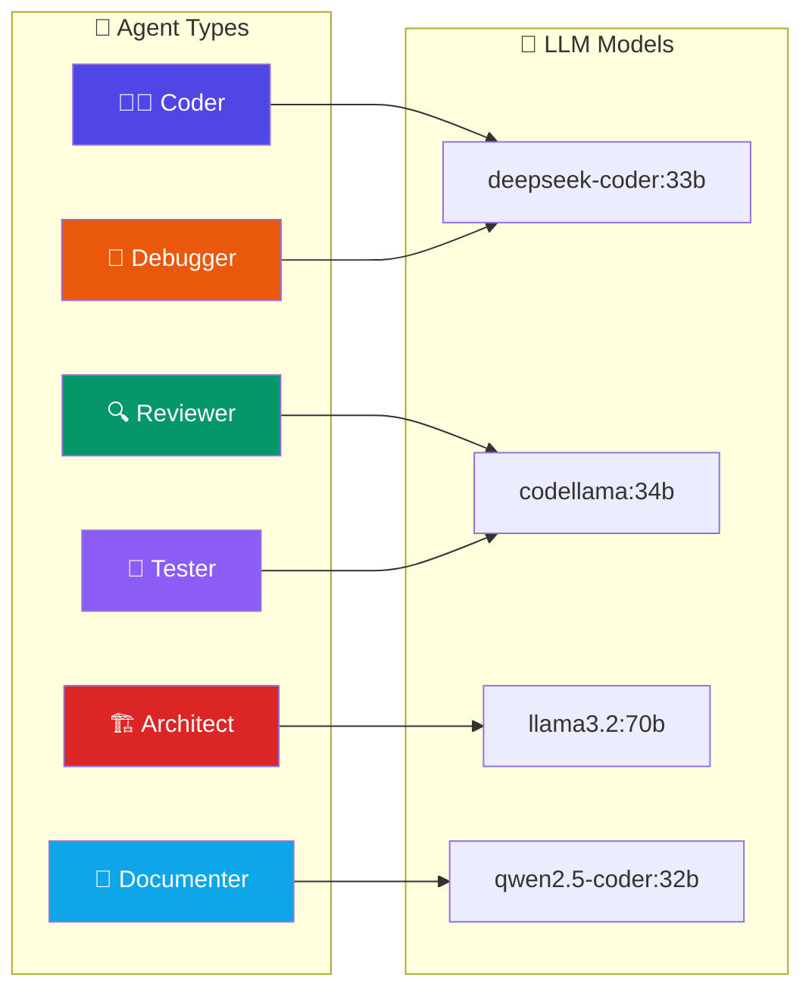
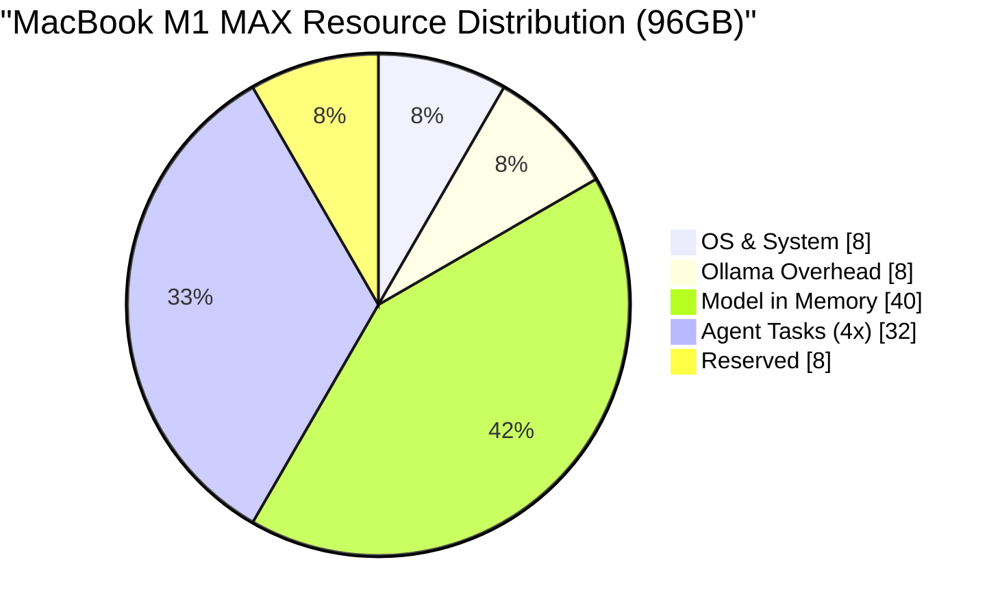
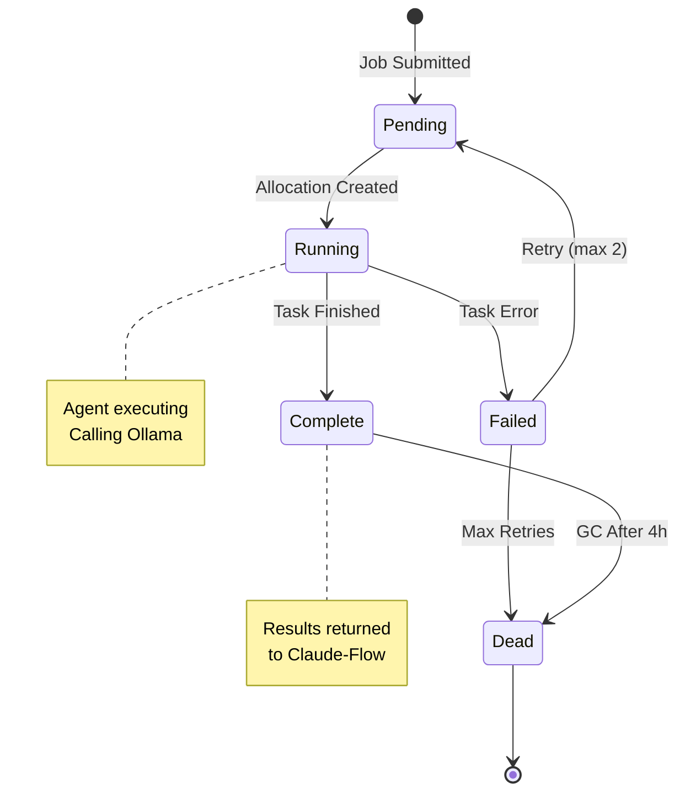
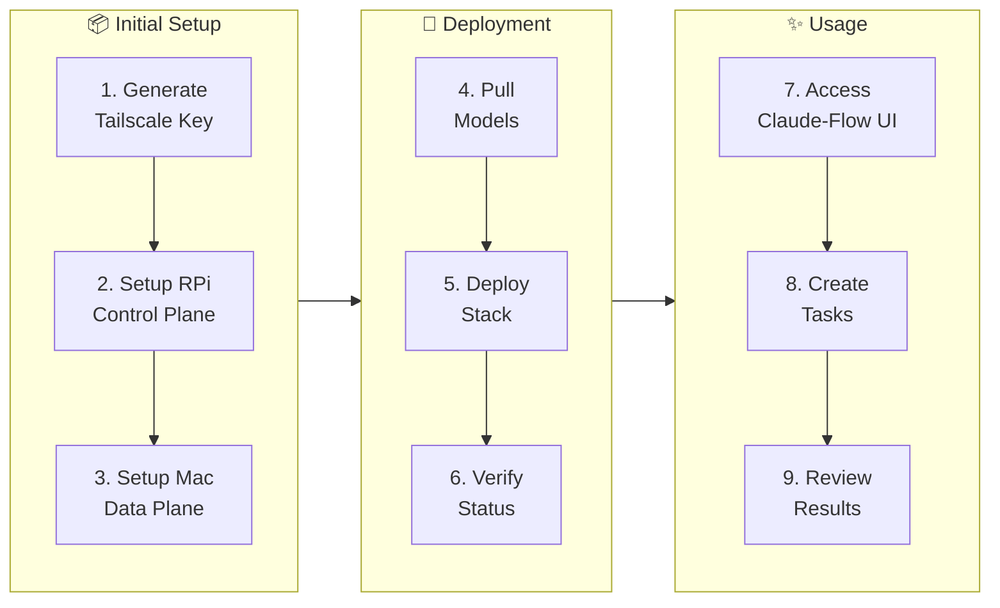
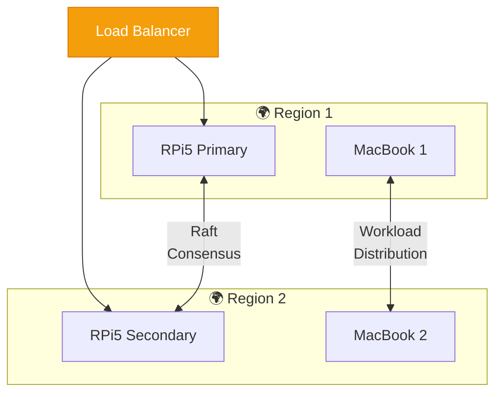
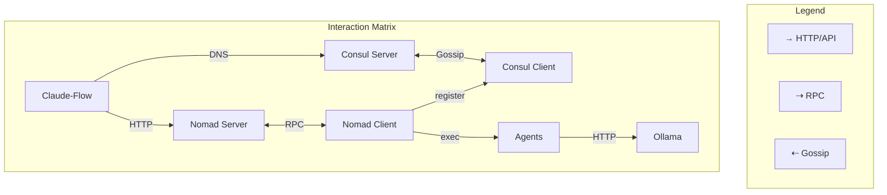

# Architecture Diagrams

This document contains Mermaid.js diagrams visualizing the system architecture.

## System Overview



## Task Execution Flow



## Network Topology



## Service Discovery



## Agent Types & Models



## Resource Allocation



## Nomad Job States



## Deployment Pipeline



## High Availability (Future)



## Component Interactions Matrix



## Viewing These Diagrams

These diagrams use [Mermaid.js](https://mermaid.js.org/) syntax. You can view them:

1. **GitHub**: Renders automatically in markdown files
2. **VS Code**: Install "Markdown Preview Mermaid Support" extension
3. **Online**: Paste into [Mermaid Live Editor](https://mermaid.live/)
4. **CLI**: Use `mmdc` (mermaid-cli) to generate images:
   ```bash
   npm install -g @mermaid-js/mermaid-cli
   mmdc -i docs/diagrams.md -o docs/diagrams.png
   ```
