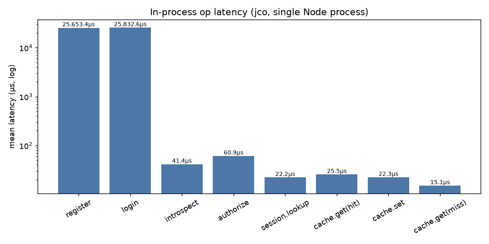
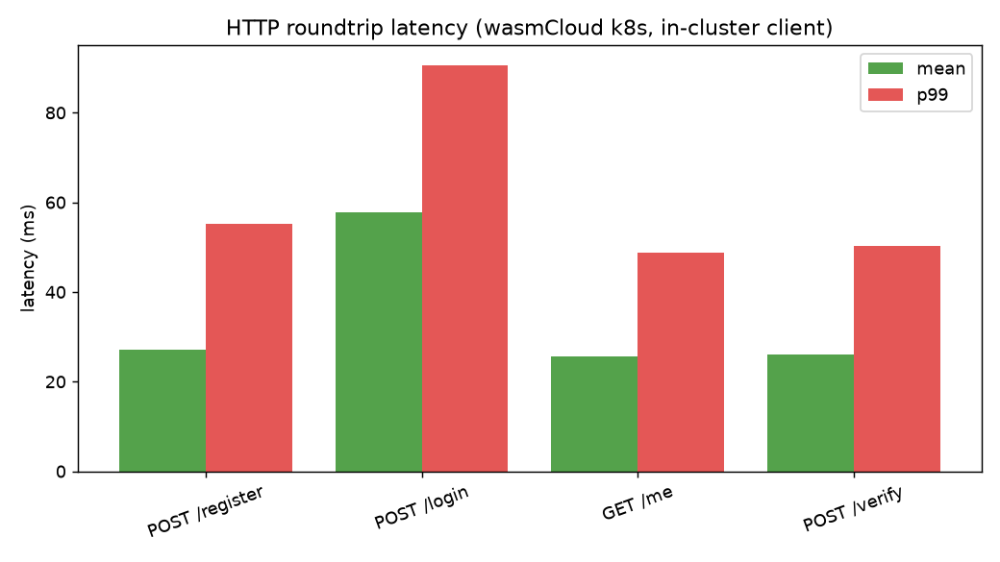
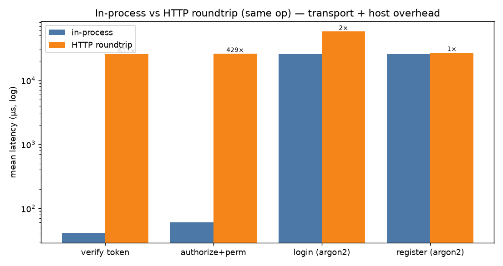

# Benchmarks

Two benches over the same components:

- **In-process** (`bench:inproc`) — the components running via `jco` inside one
  Node process: the raw compute cost of each op, no network, no host.
- **HTTP roundtrip** (`bench:http` / in-cluster runner) — the deployed
  `accounts-app` on wasmCloud k8s, driven over HTTP: the full path
  (client → http-server provider → wrpc → component → NATS kv).

Numbers are from one dev machine (Apple Silicon, OrbStack k8s) — treat them as
**relative**, not absolute SLAs.

## Run

```bash
npm install
# in-process: needs the example gens transpiled first
(cd ../examples/jco-embed && npm run transpile)
(cd ../examples/jco-cache  && npm run transpile)
AUDIT_ENABLED=false npm run bench:inproc      # -> results-inproc.json

# HTTP: a single wasmCloud host must be up (see `just k8s-collapse`). The
# in-cluster runner (incluster-bench.mjs in a pod) avoids flaky port-forwards.
# Or locally with a port-forward + AUTH_BASE_URL set:
AUTH_BASE_URL=http://localhost:8001 npm run bench:http   # -> results-http.json

npm run plot   # -> bench-inproc.png, bench-http.png, bench-overhead.png
```

## Results (representative)

### In-process (mean)



| op | mean | ops/sec |
|----|------|---------|
| register (argon2) | ~26 ms | ~39 |
| login (argon2) | ~26 ms | ~39 |
| authorize | ~61 µs | ~16k |
| introspect | ~41 µs | ~24k |
| session.lookup | ~22 µs | ~45k |
| cache.get (hit) | ~26 µs | ~39k |
| cache.set | ~22 µs | ~45k |
| cache.get (miss) | ~15 µs | ~66k |

### HTTP roundtrip (mean / p99)



| op | mean | p99 | req/sec |
|----|------|-----|---------|
| POST /register | ~27 ms | ~55 ms | ~37 |
| POST /login | ~58 ms | ~90 ms | ~17 |
| GET /me | ~26 ms | ~49 ms | ~39 |
| POST /verify | ~26 ms | ~50 ms | ~38 |

### In-process vs HTTP (same op)



## Takeaways

- **argon2 dominates register/login** (~26 ms) in both modes — by design; it's
  the password-hash cost, not the framework. It's the same order in-process and
  over HTTP because the hash, not transport, is the bottleneck.
- **Fast read paths are ~µs in-process, ~ms over HTTP.** `introspect`/`GET /me`
  is ~41 µs in-process vs ~26 ms over the wire — roughly **600×**. That gap is
  the wrpc + http-server provider + NATS + network roundtrip, *not* the
  component. See `bench-overhead.png`.
- **Implication:** co-locating the component in-process (jco) is dramatically
  cheaper for hot, cheap operations; the wasmCloud HTTP path buys distribution +
  language-agnostic deployment at a fixed per-call overhead (~25 ms here, mostly
  the local k8s networking). Same `.wasm` bytes either way.
