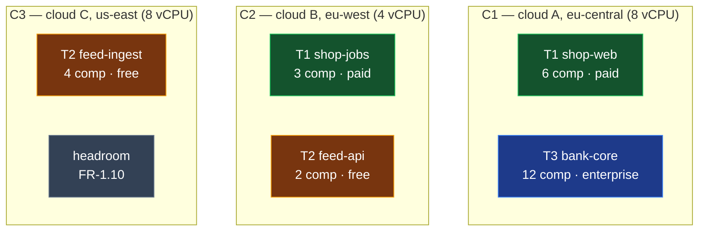
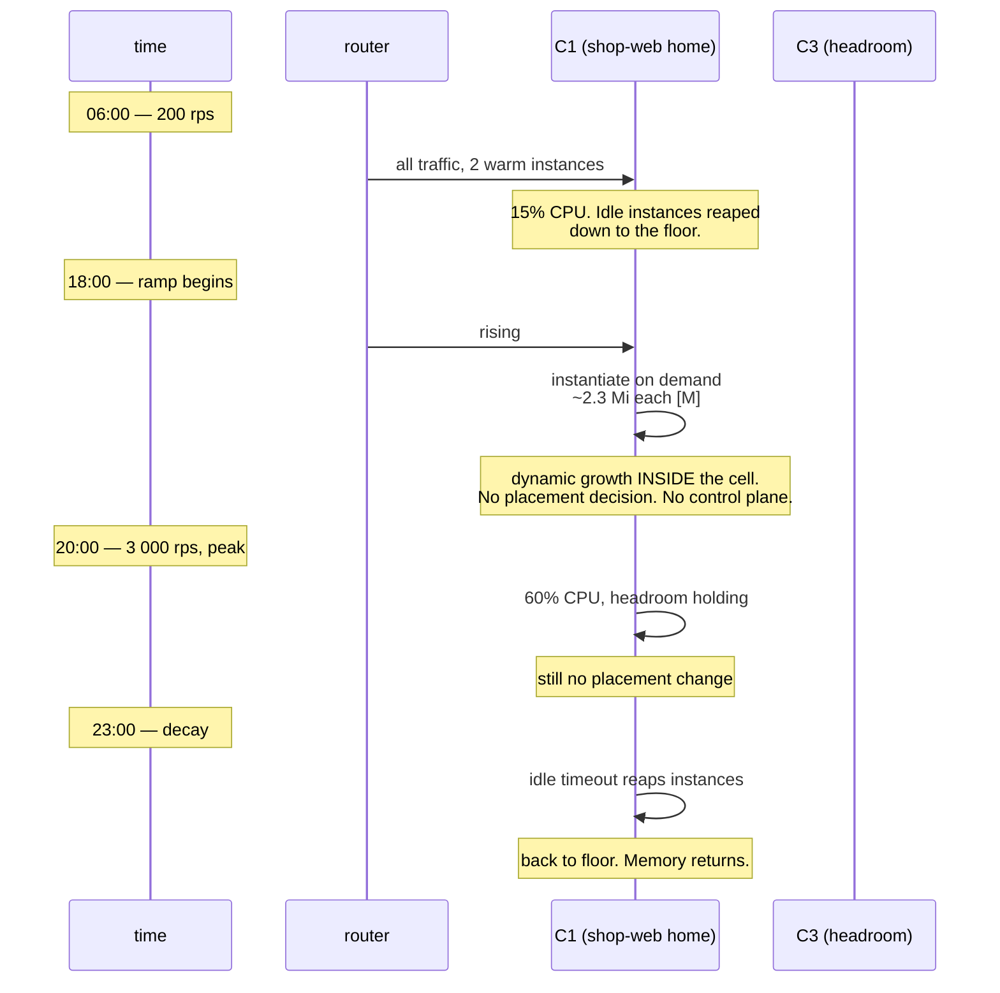
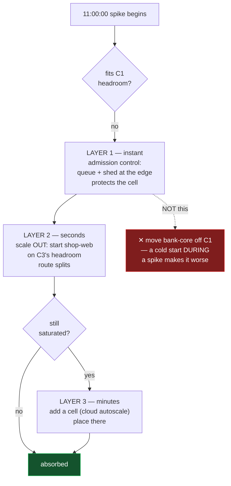
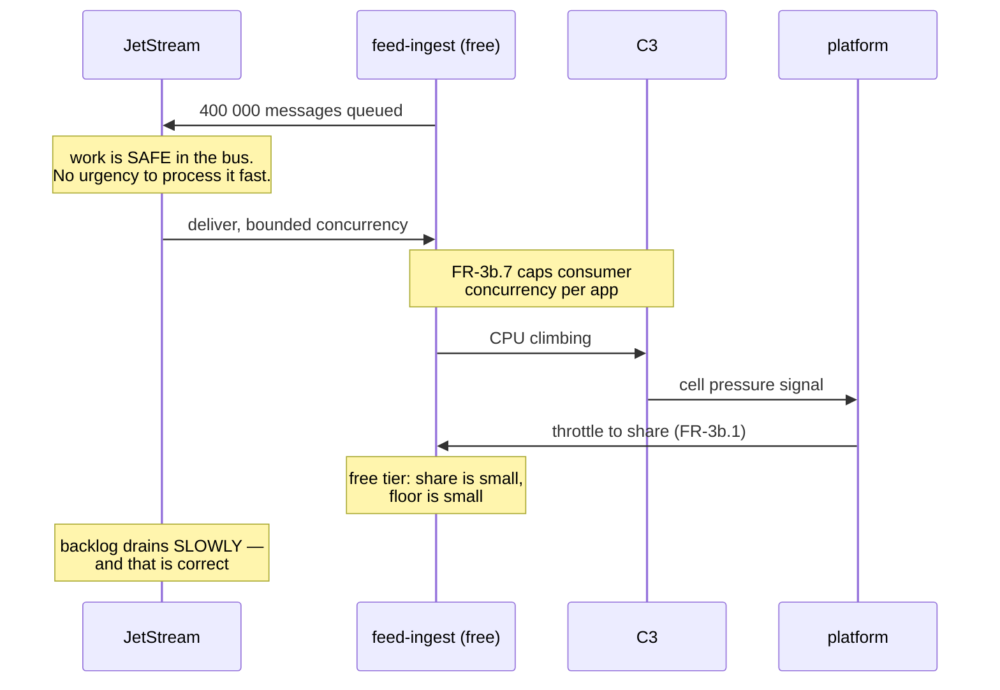
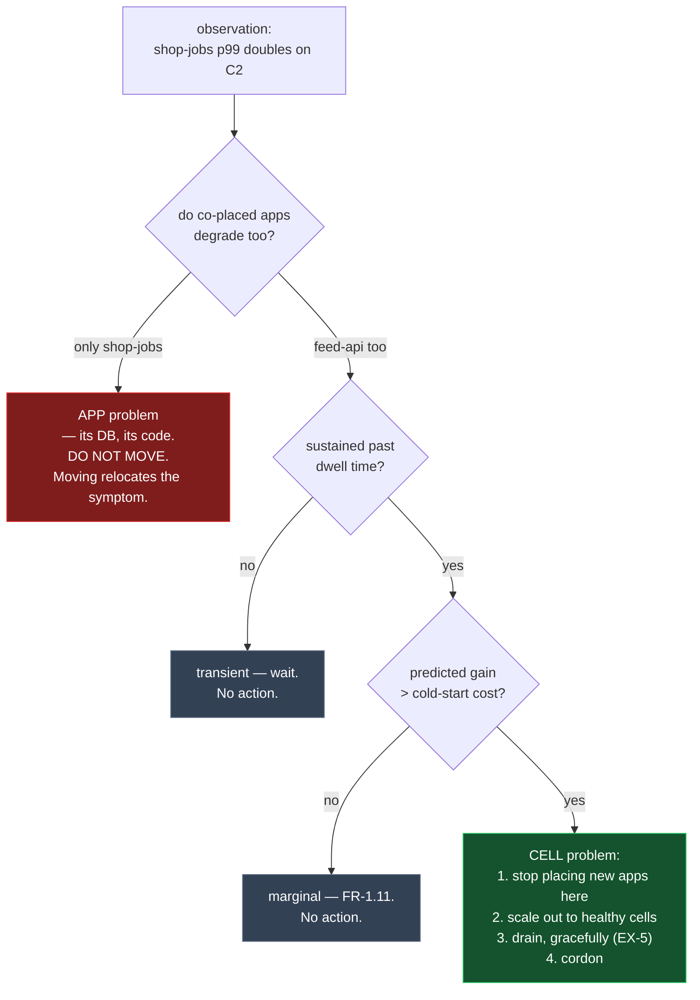
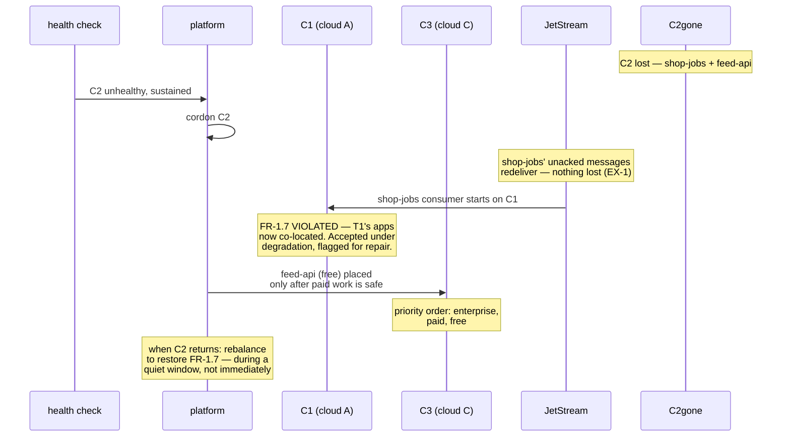

# Scenarios — three cells, three tenants, changing demand

- **Status:** draft, unmeasured — a design walkthrough, not a spec
- **Date:** 2026-08-02
- **Companion to:** [REQUIREMENTS-DENSITY.md](REQUIREMENTS-DENSITY.md),
  [TOPOLOGY-MULTIREGION.md](TOPOLOGY-MULTIREGION.md)
- **Depends on:** [G-1](REQUIREMENTS-DENSITY.md#g-1--the-isolation-probe)

Everything below is worked against one fixed setup so the trade-offs are concrete rather
than abstract. **[M]** = measured in this repo, **[E]** = estimate.

---

## 0. The fixture

Three cells, three clouds, three regions. Deliberately heterogeneous — a homogeneous
fixture hides the interesting failures.

| cell | cloud / region | size | budget |
|---|---|---|---|
| **C1** | cloud A, eu-central | 8 vCPU / 16 Gi | 8 000 core-instances |
| **C2** | cloud B, eu-west | 4 vCPU / 8 Gi | 8 000 core-instances |
| **C3** | cloud C, us-east | 8 vCPU / 16 Gi | 8 000 core-instances |

Three tenants, deliberately different shapes:

| tenant | app | shape | plan | traffic |
|---|---|---|---|---|
| **T1** "shop" | `shop-web` (6 components, linked) | HTTP, latency-sensitive | paid, standby | diurnal, spiky |
| **T1** "shop" | `shop-jobs` (3 components) | queue consumer | paid, standby | follows `shop-web`, lagged |
| **T2** "feed" | `feed-api` (2 components) | HTTP, read-heavy | free | flat, low |
| **T2** "feed" | `feed-ingest` (4 components) | queue consumer | free | bursty, batch |
| **T3** "bank" | `bank-core` (12 components, linked) | HTTP + saga | enterprise, residency: **EU only** | steady, business hours |

### The steady state placement

Applying FR-1.7 (spread a tenant's apps), FR-1.8 (hard filters first), FR-1.9 (worst-fit):

Three things this placement already encodes:

- **`bank-core` cannot go to C3.** Residency (MR-3) is a hard filter, not a preference. Its
  only failover target is C2 — which makes T3's real available capacity 12 vCPU, not 20.
- **T1's two apps are split** (FR-1.7). C1 dying costs T1 its web tier but not its job
  processing; the jobs keep draining the backlog.
- **C3 holds the least**, because worst-fit places on the emptiest viable cell and C3 was
  last to receive.

---

## 1. Scenario A — the diurnal wave (the common case)

`shop-web` goes from 200 rps overnight to 3 000 rps at 20:00, every day.

**Nothing moves.** This is the design working: an 15× traffic swing absorbed entirely by
dynamic instantiation inside one cell, because an instance costs ~2.3 Mi **[M]** and
milliseconds, not a pod and a scheduler round-trip.

**The rules that make this correct:**

- **FR-1.10's headroom is what the peak consumes.** It is not waste — it is the thing being
  bought. A cell packed to 100% at trough cannot serve a 15× peak.
- **The floor never reaps to zero** for a paid app. Reaping to zero converts the 06:00
  request into a cold start.
- **The control plane is not involved at all.** No placement loop should ever run for a
  predictable daily wave. If it does, it is misconfigured.

> **The rule:** demand changes that fit inside a cell's headroom are handled by
> instantiation, not by placement. Placement only reacts when the *cell* is wrong.

---

## 2. Scenario B — the unpredicted spike, exceeding headroom

Marketing sends an email at 11:00. `shop-web` goes to 12 000 rps in ninety seconds — past
C1's headroom.

**Order matters, and the order is by reaction time, not by preference.**

| layer | reaction | what it costs |
|---|---|---|
| 1. shed / queue at the edge | milliseconds | some requests 429 or wait |
| 2. scale out to another cell's headroom | seconds **[E]** | artifact must be pre-pulled there |
| 3. add a cell | minutes **[E]** | cloud provisioning |

**Layer 2 is scale-out, not rebalancing.** `shop-web` now runs on C1 *and* C3 and the
router splits by least-outstanding-requests. Nothing was moved, nothing drained, no cold
start on the source. This is why the previous turn's rule holds: **adding an instance
elsewhere is strictly safer than moving one.**

**What must not happen:** evicting `bank-core` from C1 to make room. It is enterprise-plan,
residency-locked to two cells, and a cold start during someone else's spike is the worst
possible moment. **Rebalancing is not a spike response** — it is too slow to help and its
cost lands on the wrong tenant.

**Where fairness enters:** during layers 1–2, C1 is contended. FR-3b.2's floor is what
guarantees `bank-core` still gets its share while `shop-web` is consuming everything else.
Without the floor, T1's marketing email degrades T3's bank.

---

## 3. Scenario C — the free tier goes bursty

`feed-ingest` (T2, free) starts a batch and tries to consume everything C3 has.

**The key insight, and it is the whole reason for the bus:** a queue backlog is not an
emergency. The work is durable, acknowledged, and safe. Draining it in six hours instead of
twenty minutes is a *service-level* difference, not a correctness one.

So the platform's response to a free-tier burst is **throttle, do not scale**. Contrast
with `shop-web`: an HTTP spike must be absorbed *now* because the requests are in flight
and will time out; a queue backlog can wait.

| | HTTP spike | queue burst |
|---|---|---|
| unabsorbed | requests fail | backlog grows |
| response | scale out, fast | throttle to share |
| deadline | the client's timeout | the tenant's patience |
| free tier | shed | slow down |

**This is where FR-3b.11 (free apps are preemptible) earns its place.** If C3 needs capacity
for a paid app, `feed-ingest` is throttled hard or paused — its work is in the bus and
loses nothing. That option exists *only* because the work is queue-backed. A free-tier HTTP
app cannot be treated the same way.

---

## 4. Scenario D — a cell degrades (not fails)

C2 does not die. Its cloud has a bad hour: p99 doubles, CPU steal climbs, disk latency
spikes. This is the case that breaks naive control loops.

**The correlation test is the whole diagnostic.** One app slow on a cell means the app is
slow. *Every* app slow on that cell means the cell is sick. A control loop without this
test will chase application bugs by moving components around, making everything worse while
looking busy.

**And cordon-then-drain, in that order.** Cordoning is free and reversible; draining is
neither. Stopping the bleeding costs nothing and buys time to decide.

**T3's constraint bites here.** If C2 is degrading and C1 is `bank-core`'s only other legal
cell, T3 has no third option — residency shrank its failover set to one. That is a real
consequence of MR-3 and it should be visible to T3 when they choose residency, not
discovered during an incident.

---

## 5. Scenario E — the cross-cloud correlated event

Cloud B has a regional incident. C2 is gone.

Four things this makes concrete:

- **The queue consumer recovers for free.** `shop-jobs` had no warm floor on C1 and did not
  need one — unacked messages redeliver, and the consumer that starts elsewhere picks up
  the backlog. Exactly [§5 of the topology doc](TOPOLOGY-MULTIREGION.md#5-unfinished-work-lives-in-the-bus-not-in-the-cell).
- **`feed-api` (HTTP, free) does not.** Its in-flight requests died with C2. It comes back
  when placed, and free tier means it is placed last.
- **Fairness constraints are soft under degradation.** FR-1.7 is violated deliberately —
  the alternative is not placing T1's jobs at all. Violation must be **recorded as debt**
  and repaired when capacity returns, not silently normalised.
- **Recovery is not the reverse of failure.** When C2 comes back it is empty and cold.
  Moving everything back immediately is a second outage in the name of tidiness. Restore
  FR-1.7 during a quiet window, under the move budget.

---

## 6. The rules, extracted

Every scenario above resolves to the same small set:

| # | rule | from |
|---|---|---|
| **R1** | Absorb demand **inside** a cell first — instantiation, not placement. Placement only reacts when the *cell* is wrong. | A |
| **R2** | Escalate by reaction time: shed → scale out → add a cell. Never rebalance as a spike response; it is too slow and bills the wrong tenant. | B |
| **R3** | **Scale out, do not move.** Adding an instance elsewhere is strictly safer than draining one. Move only when you cannot add. | B, E |
| **R4** | HTTP absorbs, queues throttle. A backlog is not an emergency; in-flight requests are. | C |
| **R5** | Correlate before acting. One app slow = app problem. All apps on a cell slow = cell problem. | D |
| **R6** | Cordon before draining. Free and reversible before expensive and not. | D |
| **R7** | Fairness constraints are hard at placement, soft under degradation — and violations become **debt**, repaired in a quiet window. | E |
| **R8** | Priority under scarcity is explicit: enterprise, paid, free. Free-tier queue work is preemptible; free-tier HTTP is shed. | C, E |
| **R9** | Recovery is a separate decision from failure, taken later and more slowly. | E |
| **R10** | Residency shrinks the failover set. The tenant must see that cost when choosing it, not during an incident. | D |

---

## 7. What is unproven here

Honest list — none of the following is measured:

| # | assumption | how to check |
|---|---|---|
| U1 | Dynamic instantiation genuinely absorbs a 15× swing without a placement change. | load-test scenario A on one cell |
| U2 | Scale-out to a second cell completes in seconds with a pre-pulled artifact. | measure; it is the whole of R3 |
| U3 | The correlation test (R5) actually distinguishes app-slow from cell-slow with real noise. | needs production-shaped telemetry |
| U4 | A free-tier consumer can be throttled hard without breaking its `ack_wait` (EX-4) — **throttling a consumer past `ack_wait` causes redelivery storms**, which look exactly like the problem being solved. | design + test together |
| U5 | Priority-ordered placement under scarcity does not starve free tier indefinitely. | needs a starvation bound |
| U6 | The move budget and dwell time have workable values. Pure guesses today. | tune against U1–U3 |

**U4 is the one most likely to bite.** Throttling and acknowledgement deadlines interact,
and getting it wrong turns a throttle into a redelivery loop that consumes more capacity
than it saves.
