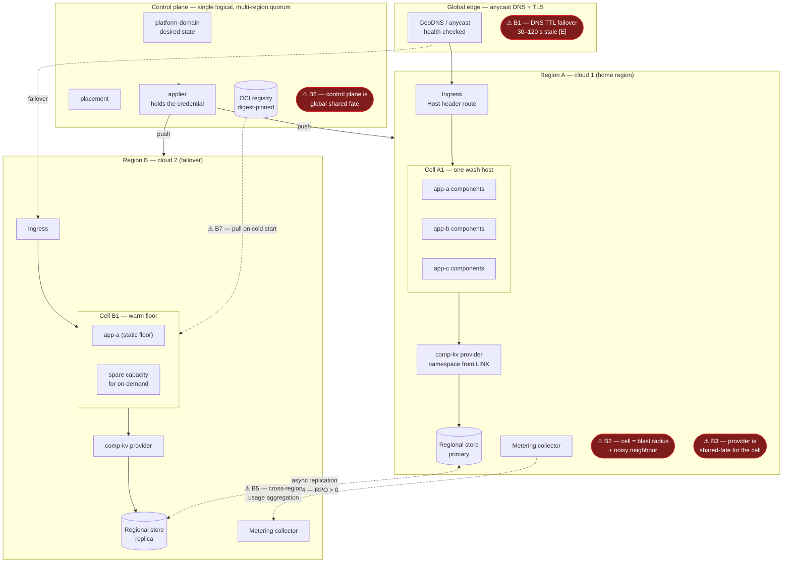
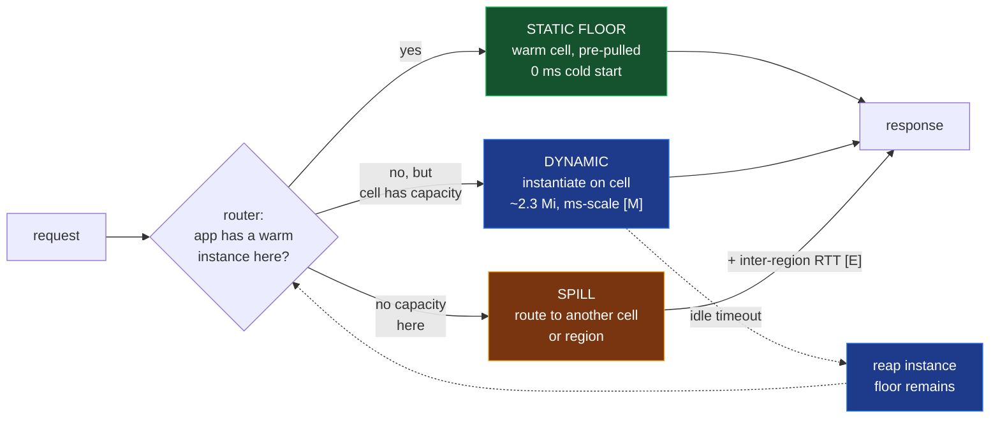
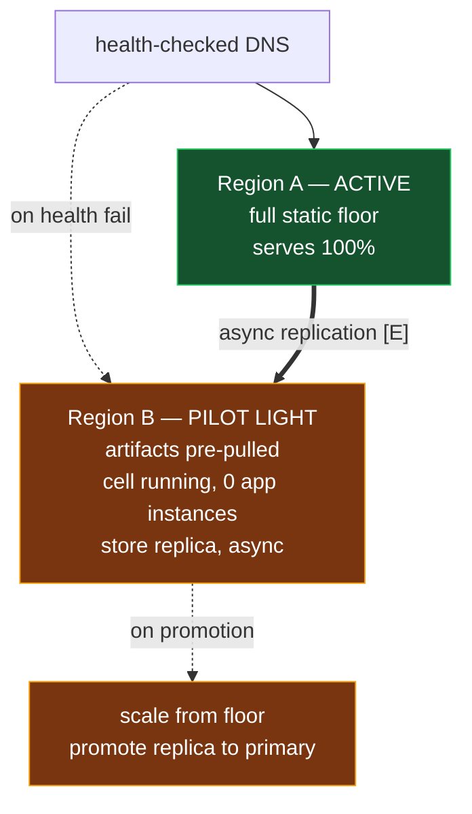
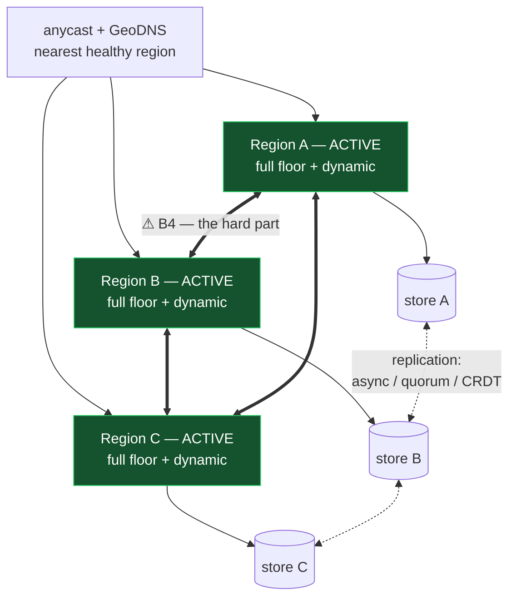
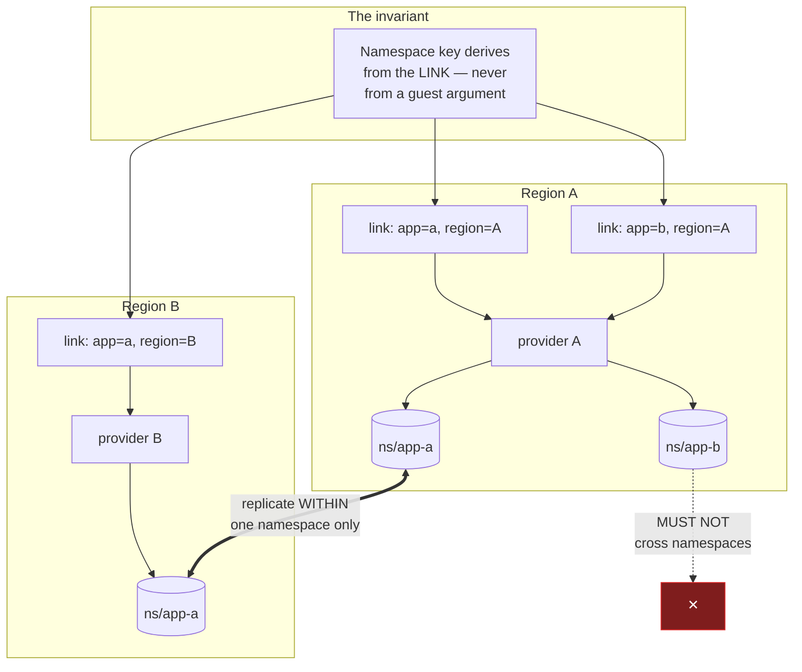
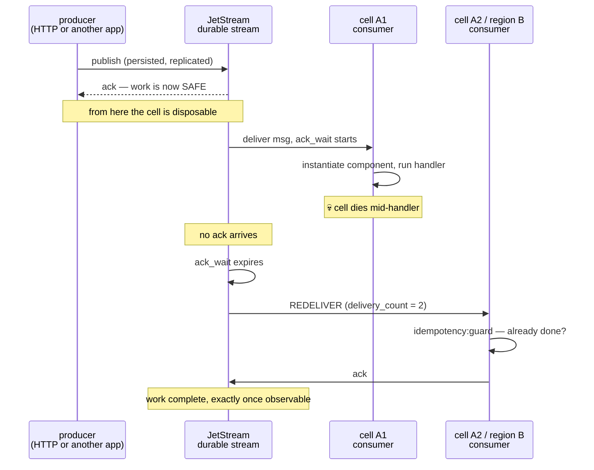
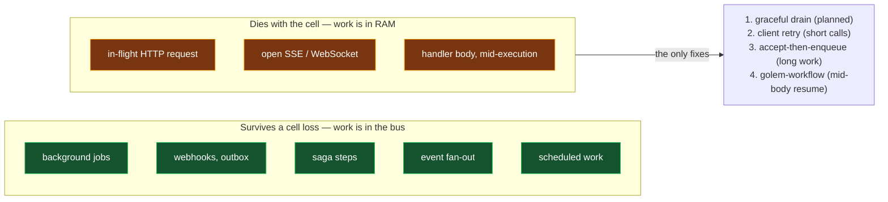

# Topology — multi-cloud, multi-region, multi-tenant

- **Status:** draft, unmeasured
- **Date:** 2026-08-02
- **Companion to:** [REQUIREMENTS-DENSITY.md](REQUIREMENTS-DENSITY.md)
- **Depends on:** [G-1](REQUIREMENTS-DENSITY.md#g-1--the-isolation-probe) — if link config
  does not carry app identity, the shared cell does not exist and most of this document
  is void

> **Provenance of every number below.** Figures marked **[M]** are measured in this repo
> ([ADR-0019](adr/0019-the-density-number.md),
> [ADR-0020](adr/0020-the-density-number-under-load.md), `bench/HOST-PERF.md`). Figures
> marked **[E]** are estimates from public cloud inter-region baselines and are **not
> measured here** — they set expectations and shape the design, and every one of them
> must be replaced by a measurement before it is quoted to anyone.

---

## 1. The layer cake, with where it hurts

### The bottlenecks, ranked by how likely they are to ruin your day

| # | bottleneck | cost | mitigation |
|---|---|---|---|
| **B4** | **Cross-region storage replication.** Async gives RPO > 0; sync pays the inter-region RTT on **every write**. | 60–150 ms added write latency for sync EU↔US **[E]**; or seconds of data loss on async failover | Per-app choice, priced differently. Default async. |
| **B2** | **Cell blast radius + noisy neighbour.** Density's whole point is sharing; sharing is the risk. | one cell loss = all its apps | Bound apps per cell; fence CPU and memory (FR-3); measure at [G-4](REQUIREMENTS-DENSITY.md#g-4--the-noisy-neighbour-measurement) |
| **B6** | **Control plane global shared fate.** One `platform-domain`, one applier credential ([ADR-0003](adr/0003-control-plane-is-wasm-plus-applier.md)). | control plane down = no deploys, no failover *decisions* | Data plane must survive control plane loss. Regions keep serving from last-applied state. |
| **B1** | **DNS failover is slow.** | 30–120 s of traffic to a dead region **[E]** | Anycast + health-checked BGP withdrawal instead of TTL expiry, where the provider allows |
| **B7** | **Cold artifact pull.** A failover region without the image pays a registry pull before first request. | seconds to tens of seconds **[E]** | Pre-pull to every region in the app's failover set. This is what "static floor" buys. |
| **B3** | **Provider is shared-fate for its cell.** Every app on the cell loses storage if it dies. | cell-wide storage outage | Provider per cell, not per region; restart independent of the host |
| **B5** | **Cross-region metering aggregation.** Usage written in two regions must reconcile without double-counting or loss (FR-4.4). | billing errors, which are worse than outages | Region-local durable write, idempotent keys, async roll-up |

**Not a bottleneck:** the intra-cell component hop. Measured at 1.6% throughput cost for
3 extra components **[M]** ([ADR-0020](adr/0020-the-density-number-under-load.md)). Every
inter-region arrow above costs 100× what an intra-cell arrow costs. **The topology, not
the runtime, is the latency budget.**

---

## 2. Static floor and dynamic burst

Two deployment modes, one placement engine.

| | static floor | dynamic |
|---|---|---|
| **what it is** | pre-pulled artifact + warm instances, always resident | instantiate on arrival, reap on idle |
| **cost** | paid 24/7 | paid per use |
| **cold start** | none | one instantiation |
| **why it exists** | failover readiness and p99 | density and cost |
| **billed as** | reserved | consumed |

**The floor is the unit of failover readiness, not just of latency.** A region with a
static floor for app X can absorb X's traffic immediately; a region without one pays B7
plus instantiation on the first request of an outage — exactly when you can least afford
it.

**What makes dynamic cheap here is measured [M]:** an extra component on a warm host costs
~2.3 Mi cold, against ~70 Mi for a pod. Scale-to-zero for the *pod* shape means a cold
pod; for the *cell* shape it means a warm host with no instance — which is a fundamentally
cheaper thing to restore. **This is the strongest argument for the whole density design,
and it is about failover, not about idle cost.**

---

## 3. Failover strategies

### 3.1 Minimum viable — the cheapest thing that survives a region

- **2 regions, preferably 2 clouds** (correlated-failure independence; a cloud's control
  plane is a single failure domain)
- Region B runs the **cell** but not the apps — you pay the ~233 Mi settled host floor
  **[M]** and the pre-pulled artifacts, not per-app instances
- **RTO: 1–5 min [E]** — DNS (B1) + promotion + instantiation
- **RPO: seconds to minutes [E]** — async replication lag (B4)
- **Cost: ~1.1× single region** — one host floor plus storage replica, not 2×

**Cheapest correct answer for most apps.** Pilot light exists precisely because the cell
model makes "warm host, no instances" a viable resting state.

### 3.2 Latency-optimal — active/active

- **3+ regions**, every one serving, users routed to nearest
- **RTO: seconds [E]** — health check plus route withdrawal, no promotion step
- **RPO: 0 for quorum writes, > 0 for async [E]**
- **Cost: 3×+**
- **User-facing latency: best possible** — the 2.79 ms p50 **[M]** is preserved because
  the request never crosses a region

**The catch is entirely in the storage tier.** Compute is stateless and easy to run
active/active; the store is not. Three options, and this is a per-app choice:

| model | write latency | consistency | fits |
|---|---|---|---|
| single-writer + read replicas | cross-region on write **[E]** | strong | read-heavy |
| quorum (Raft, 3 regions) | ~1 inter-region RTT **[E]** | strong | balanced, expensive |
| CRDT / last-writer-wins | local, fast | eventual | `components/` already has a CRDT — see `CRDT.md` |

### 3.3 The recommendation

**Tier it, per app, as a plan — not a platform-wide decision.**

| plan | shape | RTO **[E]** | RPO **[E]** | rel. cost |
|---|---|---|---|---|
| single region | one cell, no failover | hours | last backup | 1× |
| standby | §3.1 pilot light | 1–5 min | seconds | ~1.1× |
| active/active | §3.2 | seconds | 0 or seconds | 3×+ |

This mirrors FR-1.3: **a placement choice on the app spec, not a different code path.**

---

## 4. Isolation across regions

Everything in [FR-2](REQUIREMENTS-DENSITY.md#fr-2--storage-isolation) must hold **per
region and across regions**, which adds four requirements the single-region doc does not
cover:

| id | requirement |
|---|---|
| **MR-1** | Replication is **per namespace**. A replication stream must not be able to carry another app's records, even transiently or in an error path. |
| **MR-2** | The namespace key is **globally stable** — the same app has the same key in every region. Region is not part of the key, or failover reads the wrong namespace. |
| **MR-3** | An app pinned to a region for data-residency reasons must **not** be replicated out of it. Residency is an isolation requirement, not a performance one. |
| **MR-4** | A cross-region replication credential must not be able to read the whole store. Compromising region B's replica must not yield region A's other tenants. |

**MR-2 and MR-3 pull against each other**, and that tension is the design's sharpest edge:
a globally stable key makes failover trivial, and it makes accidental cross-region
replication of a residency-pinned app equally trivial. The residency flag must be enforced
at the **replication configuration** layer, not by hoping the key is never replicated.

---

## 5. Unfinished work lives in the bus, not in the cell

**The design rule: a cell holds no work that would be lost if it died.** Unfinished work
is a message in a durable stream with an outstanding acknowledgement. A cell is a
*consumer* of that stream — disposable by construction, because everything it is working
on is still in the stream until it acks.

This is wasmCloud's own model (`wasmcloud:messaging` over NATS), and
[JOBS.md](../JOBS.md) already draws the distinction that matters:

- **Durable timing and retry** — the queue's job. Enqueue with delay, claim under a
  crash-safe lease, fail with backoff, dead-letter after the cap, replay.
- **Durable execution** — the workflow backend's job. Whether a single long-running
  handler survives a crash *mid-body* and resumes from that point.

**The bus gives you the first, cheaply and for everything. Only the second needs
`golem-workflow`, and only for handlers that are long enough to care.** Conflating them is
what makes people think they need durable execution when a redelivery would do.

### How a cell loss actually plays out

Nothing was checkpointed. Nothing was migrated. The work survived because **it was never
in the cell to begin with** — the cell only ever borrowed it under a lease.

The same picture answers §3's failover question for async work: **a queue-backed app needs
no warm floor in region B for correctness.** A consumer that starts there picks up the
backlog. The floor buys latency, not safety.

### Where the boundary sits

**Accept-then-enqueue is the pattern that moves work across that line.** An endpoint that
does real work synchronously is betting on the cell; one that persists an intent, returns
202, and lets a consumer do the work is not. That is a design choice the platform should
make easy and document, not one it can impose.

### What this demands

| id | requirement |
|---|---|
| **EX-1** | Any work that must not be lost is **published to a durable stream before it is acknowledged to its producer**. A cell that dies holding only unacked messages loses nothing. |
| **EX-2** | Streams are **per application**, subject-namespaced from the same link identity as storage (FR-2.2). An app can neither consume nor publish on another app's subjects (FR-2.6). |
| **EX-3** | Handlers are **idempotent under redelivery**. Redelivery is normal operation, not an error path. `idempotency:guard` exists for this and its use is a platform expectation, not a suggestion. |
| **EX-4** | `ack_wait` is bounded and stated per app: too short redelivers work still running, too long stalls recovery. It is the real recovery-time knob for async work and belongs in the app's plan. |
| **EX-5** | **Graceful drain** (FR-5.4): stop pulling new messages, finish in-flight ones under a deadline, ack, exit. Planned termination is the overwhelming majority of cell deaths — this path must actually work and must be tested under load. |
| **EX-6** | Delivery attempts are capped and exhausted messages **dead-letter** rather than redeliver forever. A poison message must not be able to consume a cell indefinitely. |
| **EX-7** | Stream storage is replicated to the app's failover regions with the same per-namespace discipline as MR-1. A regional loss must not lose acknowledged-but-unprocessed work. |
| **EX-8** | Redelivery is **metered once per delivery and attributed to the owning app**, and a retry storm is visible in usage rather than silently absorbed. |
| **EX-9** | Synchronous HTTP work is **explicitly out of scope** for this guarantee, and tenants are told so. The mitigations are drain, client retry, accept-then-enqueue, or `golem-workflow`. |

### What already exists

Nearly all of it — this is a wiring and policy exercise, not a build:

| need | in the catalog |
|---|---|
| durable queue, lease, backoff, dead-letter, replay | `outbox` / `outbox:dispatch`, `jobs-domain` |
| exactly-once effects under redelivery | `idempotency-guard` |
| compensation across steps | `saga-domain`, `fsm-workflow` |
| event distribution | `event-bus`, `event-pusher` |
| scheduled and delayed work | `scheduler-timer`, `cron`, `rrule` |
| mid-body crash resumption | `golem-bridge` + `golem-workflow` (`durable:workflow`) |

**The missing piece is the substrate, not the components.** [ADR-0014](adr/0014-an-application-owns-a-host.md)
gave every app a private NATS sidecar to get isolation. At density that shape is exactly
what the storage argument rejects — isolation by duplication, one NATS per app. The
message bus needs the same fix as keyvalue: **one JetStream per cell or region, subjects
and streams namespaced by platform-authored link identity, and the guest unable to name
its way out.**

That makes [G-1](REQUIREMENTS-DENSITY.md#g-1--the-isolation-probe) load-bearing for
messaging too, not only for storage — so the probe should cover `wasmcloud:messaging`
subjects in the same pass rather than as a follow-up.

---

## 6. Open questions

Extends [REQUIREMENTS-DENSITY.md §5](REQUIREMENTS-DENSITY.md#5-open-questions).

| # | question | blocks |
|---|---|---|
| T1 | Multi-cloud, or multi-region within one cloud? Multi-cloud buys correlated-failure independence and costs a portable substrate and egress fees. | §3, cost model |
| T2 | Does the control plane run active/active, or single-region with a documented outage window (B6)? | B6 |
| T3 | What backs cross-region replication — the store's native mechanism, or something platform-level? Depends on Q4 (SQLite / Redis / Postgres). | B4, MR-1 |
| T4 | Does the applier push per region, or does each region pull? [ADR-0017](adr/0017-the-applier-pushes-and-the-registry-is-a-cache.md) says push; that was written for one region. | B7, control plane |
| T5 | Is the static floor per region per app, or per region per *plan*? Per app is precise and expensive to place. | §2 |
| T6 | What is the actual inter-region RTT on the target clouds? **Every [E] above is a placeholder until measured.** | all latency claims |
| T7 | Does data residency (MR-3) need to be a hard platform capability now, or is it a later plan tier? | MR-3, legal |
| T8 | One JetStream per cell, per region, or a stretched cluster across regions? Stretched simplifies failover and pays the inter-region RTT on every persisted write. | §5, EX-7 |
| T9 | Does the shared JetStream reuse the *data* NATS from [ADR-0014](adr/0014-an-application-owns-a-host.md), now shared instead of per-app, or is it a separate cluster from the keyvalue backend? | §5, Q4 |
| T10 | Is `golem-workflow` a platform-offered plan tier for mid-body durable execution, or purely a tenant compose-time choice as JOBS.md has it today? | EX-9 |

---

## 7. What to measure first

In order. Each is cheap and each kills a wrong assumption early.

1. **[G-1](REQUIREMENTS-DENSITY.md#g-1--the-isolation-probe), covering storage *and*
   messaging subjects** — without it there is no shared cell and this document is void.
2. **T6, inter-region RTT** — replaces every **[E]** with a number and decides §3.2's
   viability.
3. **Cold-start of a pilot-light region** — the real RTO in §3.1, which is currently the
   softest estimate here.
4. **[G-4](REQUIREMENTS-DENSITY.md#g-4--the-noisy-neighbour-measurement)** — noisy
   neighbour, the most likely quiet failure of the density design.
5. **Graceful drain (EX-4)** under load — the common case, and the one that silently does
   not work until tested.
